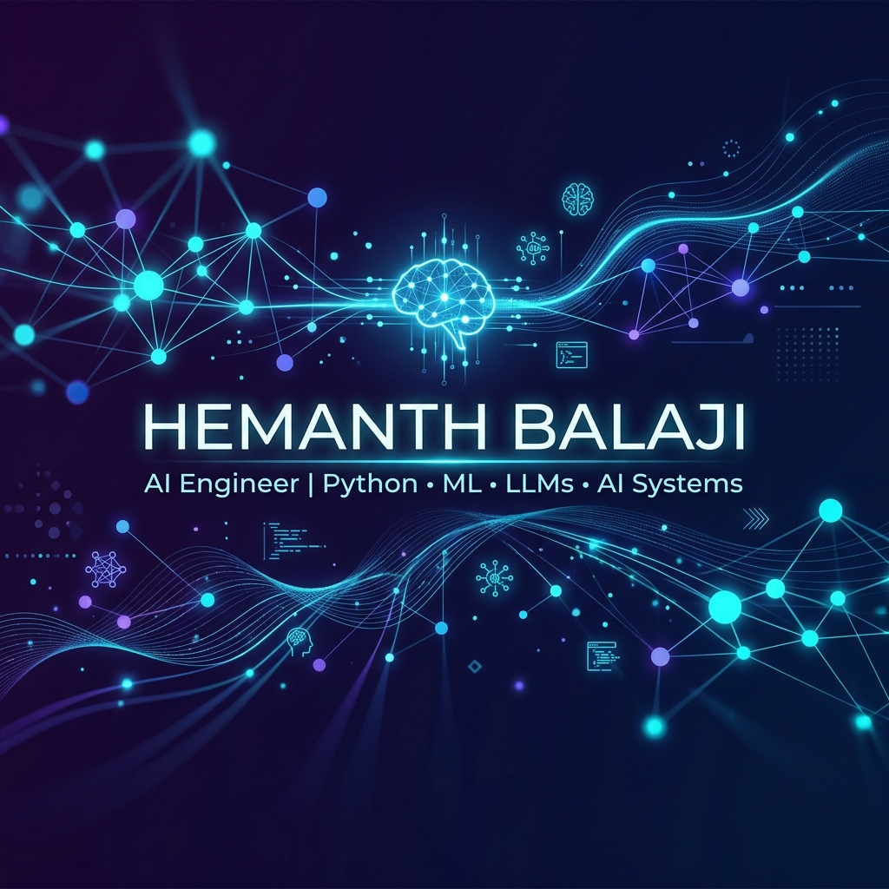

<!-- 
This README was custom-designed for Hemanth Balaji by Antigravity.
To activate it on your profile:
1. Create a public repository named exactly "hemanthbalaji07"
2. Commit this README.md and the accompanying github_profile_banner.png to that repository.
-->

  

<h1 align="center">Hi there, I'm Hemanth Balaji! 👋</h1>

  <b>Building toward becoming an AI Engineer • Passionate about Python, ML, LLMs, and AI Systems</b>

  
  

---

### 🚀 About Me

I am a highly motivated aspiring **AI Engineer** dedicated to building, optimizing, and scaling intelligent systems. I believe in learning by doing, and I am documenting my progression, core concepts, and hands-on projects in my dedicated repository:

👉 **[ai-engineering-journey](https://github.com/hemanthbalaji07/ai-engineering-journey)** — My learning path covering mathematics, classical machine learning, deep learning, and advanced AI application systems.

- 🌱 **Currently Focused On**: Deep learning architectures, parameter-efficient fine-tuning (LoRA/QLoRA), Retrieval-Augmented Generation (RAG) paradigms, and deploying LLMs.
- 💡 **Core Interests**: Neural Networks, LLM Fine-Tuning, Multi-Agent Systems, High-Performance AI Inference, and Vector Databases.
- 🎯 **Long-Term Goal**: Engineering state-of-the-art AI systems that solve real-world problems at scale.

---

### 🛠️ Technical Toolbox

<table width="100%">
  <tr>
    <td width="50%" valign="top">
      <h4>💻 Languages</h4>
      &nbsp;
      &nbsp;
      &nbsp;
      
        
      <h4>🧠 Machine Learning & Deep Learning</h4>
      &nbsp;
      &nbsp;
      &nbsp;
      &nbsp;
      
    </td>
    <td width="50%" valign="top">
      <h4>🤖 Generative AI & LLM Tech</h4>
      &nbsp;
      &nbsp;
      &nbsp;
      
        
      <h4>🛠️ Developer Ecosystem</h4>
      &nbsp;
      &nbsp;
      &nbsp;
      
    </td>
  </tr>
</table>

---

### 📊 GitHub Activity & Metrics

<table align="center" width="100%">
  <tr>
    <td width="50%" align="center" valign="top">
      
    </td>
    <td width="50%" align="center" valign="top">
      
    </td>
  </tr>
  <tr>
    <td colspan="2" align="center" valign="top">
       
      
    </td>
  </tr>
</table>

---

  <i>"The best way to predict the future is to invent it." — Alan Kay</i> 
  <b>Thank you for visiting! Feel free to explore my repositories or connect. Let's build something intelligent.</b>

